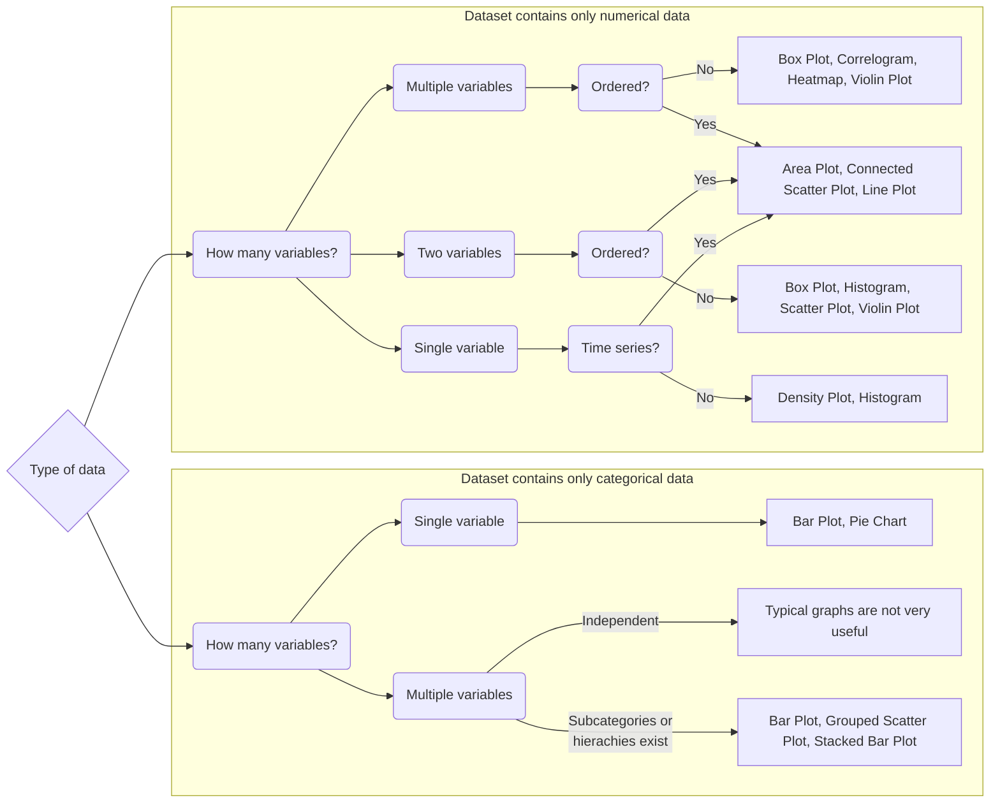
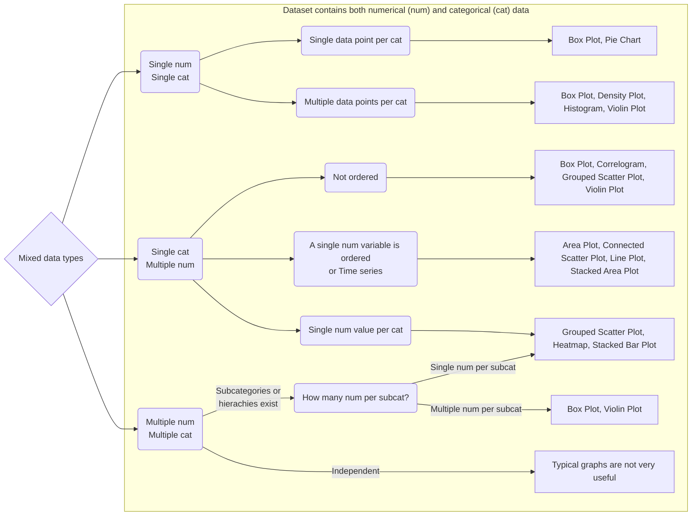

# Data Visualisation: When to use what graph?

**Authors:** [Darren Teo](https://www.linkedin.com/in/darren-teo-3125871a1/), [Hillson Hung](https://www.linkedin.com/in/hillson-hung/)

**About the Authors:** Year 3 student in NUS in Special Programme in Science, Darren and Hillson are currently majoring in Life Sciences and Physics respectively.

**About this tutorial:** Data visualisation is all about presenting your data accurately and succinctly so that your audience can see what it means. In this section we provide some quick and easy guidelines to decide what to use to represent your data. Keep in mind that what we cover are not rigid rules that you must always follow, it is just a general guideline. The most important thing is not to get caught up in all the fancy graphs and charts and to present your data such that it tells a clear story.

## Different kinds of data

There are three main kinds of data, exclusively numerical, exclusively categorical and a mix of the two. There are many ways to represent numerical data, depending on the number of variables and whether it is ordered in some way or other. On the other hand, exclusively categorical data is usually harder to visualise, especially when there are multiple independent categorical variables. Below is a quick flowchart for which methods of data visualisation to use for the different kinds of data.

### Exclusively Numerical/Categorical Data Flowchart

### Mixed Numerical and Categorical Data Flowchart

